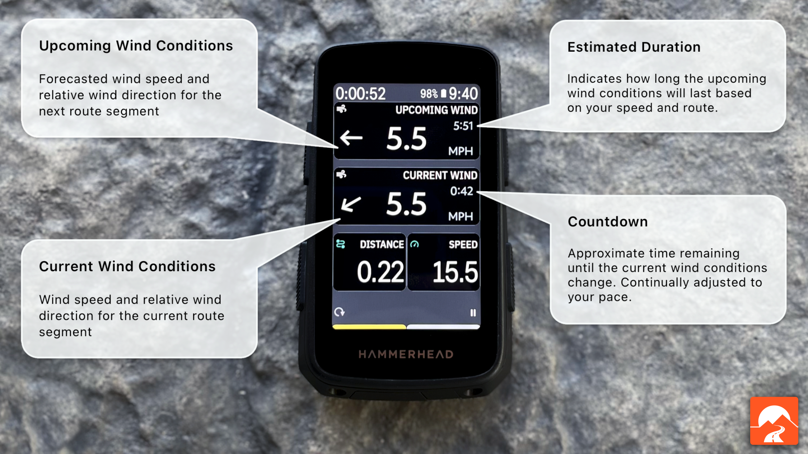

# Epic Ride Weather for Karoo Beta

Welcome to the Epic Ride Weather for Karoo beta! Our goal is to bring you actionable information so that you can make decisions about your ride.

Epic Ride Weather adds **Current Wind** and **Upcoming Wind** to the Hammerhead Karoo:

**Current Wind** and **Upcoming Wind** show the wind speed and relative direction for their respective section of your ride. 

## How it Works

Once you've installed the Epic Ride Weather extension on your Karoo, you can add wind conditions to any data page. 

When you start a ride that follows a route, the Epic Ride Weather app provides hyperlocal forecasts for your ride. The route is segmented according to the windspeed and bearing. As you progress through your ride, the app displays a countdown for the remaining time with the current conditions, and a prediction the next segment.

Displayed windspeed is absolute and wind direction is relative to the bearing of your route.

## Hook me Up!

To use the extension you will need the Epic Ride Weather app on your mobile device.

New to Epic Ride Weather? Learn more at <a href="https://www.epicrideweather.com">https://epicrideweather.com</a>

## Feedback

We want to hear from you! Feel free to send us your feedback, questions, ideas and feature requests: <a href="mailto:james@epicrideweather.com">james@epicrideweather.com</a>

## How to Install

Detailed instructions for loading the app on your Karoo are on provided on the Hammerhead support page: https://support.hammerhead.io/hc/en-us/articles/34676015530907-Karoo-OS-Extensions-Library

## Setup

1. Open Epic Ride Weather on your Karoo from the extensions library.
2. Tap on the ``Connect Account`` button, and scan the QR code with the camera app on your phone.
3. The Epic Ride Weather app will open open, tap ``Add Device`` in Epic Ride Weather. This connects your Karoo to your Epic Ride Weather account. 
> Tip: If the Epic Ride Weather app doesn't open, ensure that you have the latest version installed on your phone from the App Store. Navigate to the account page in Epic Ride Weather, which will activate the beta. Then try scanning the QR code again.
4. Add a Current Wind or Upcoming Wind datatype to your ride profile.

You're done! To try it out, start a ride following a route.

### Tips

- Countdown time and estimated duration are based on your average speed, and will become more accurate as you ride
- The Upcoming Wind datatype is most useful when you also have Current Wind, since the countdown time for the current segment will tell you when the upcoming segment starts.

## Troubleshooting

This is a beta, so we expect that there could be defects. Feel free to contact us for support via email <a href="mailto:james@epicrideweather.com">james@epicrideweather.com</a> or with a GitHub issue on this page.

Here are some common toubleshooting steps for error messages:

### No Internet

To recieve weather forecasts, make sure that your Karoo is either paired to your phone via the Hammerhead Companion app or connected to the internet using WiFi. Karoo devices automatically turn off WiFi when starting a route to save power, so if you're relying on WiFi you'll need to turn it back on after starting your ride.

If you're using the internet through the Hammerhead Companion app and you see this message, try waiting 30 seconds to see if it resolves itself. Sometimes it takes a few moments to make a connection.

### No Route

The extension will only show weather conditions if you are following a route. To follow a route, navigate to the Routes page, select your desired route, and tap on ``Follow`` or the checkmark button.

### Check Account

Your Karoo must be connected to your Epic Ride Weather account to use it. This message indicates that either your account is not connected or your Epic Ride Weather subscription is no longer valid. To reconnect your account, follow the setup steps above. Feel free to contact support if the issue persists.

### Out Of Range

To get accurate weather data, you need to be near the route. This message indicates that you are further than 1km from the nearest segment. To fix this, either navigate back to the route or wait for the GPS signal to improve.

### Other Issues

If it's unsuccessful enough times, the app will eventually stop trying to get a forecast to save battery. If the error message is still showing up, you can try restarting the ride on your Karoo which will cause the app to try again.

## License

Use of Epic Ride Weather and the Epic Ride Weather for Karoo companion app are subject to the [terms of use](https://www.epicrideweather.com/terms-of-use/) and [privacy policy](https://www.epicrideweather.com/privacy-policy/).
