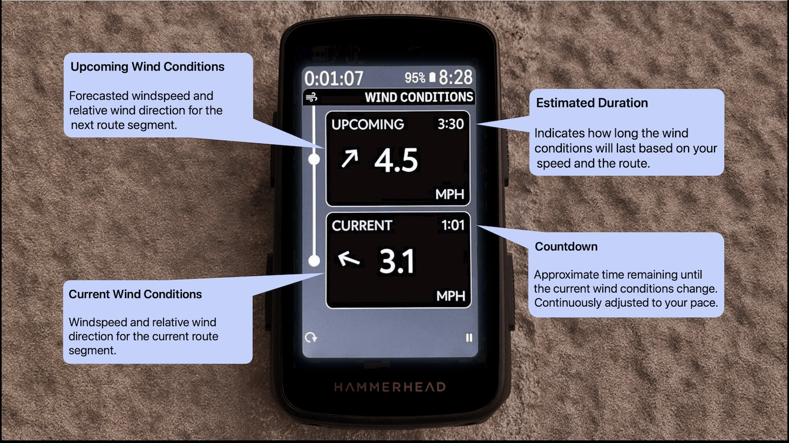
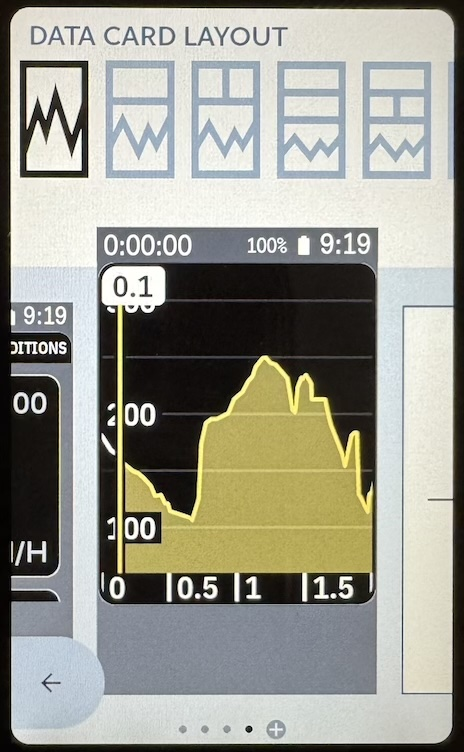
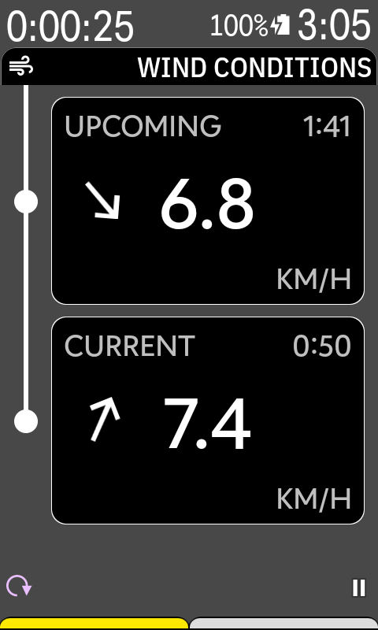
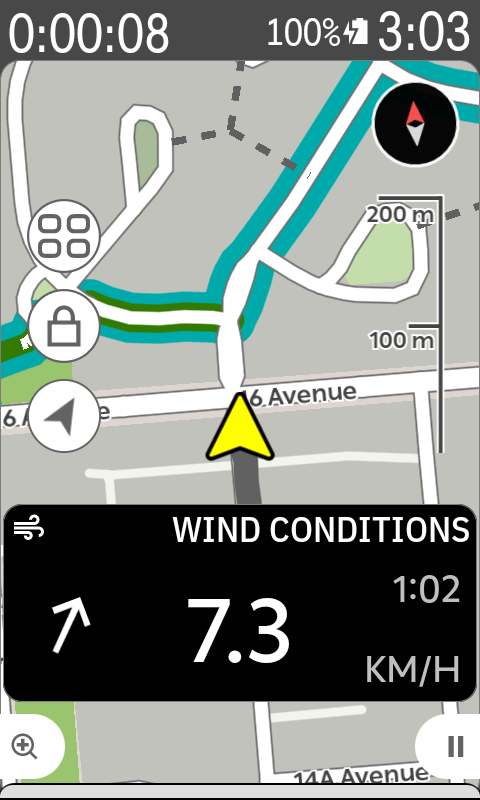

# Epic Ride Weather for Karoo Beta

Welcome to the Epic Ride Weather for Karoo beta! Our goal is to bring you actionable information so that you can make decisions about your ride.

Epic Ride Weather adds Wind Conditions to the Hammerhead Karoo:

Wind Conditions show the wind speed and relative direction for the current section and the next section on your route. 

## How it Works

Once you've installed the Epic Ride Weather extension on your Karoo, you can add Wind Conditions to any data page. 

When you start a ride that follows a route, the Epic Ride Weather app provides hyperlocal forecasts for your ride. The route is segmented according to the windspeed and bearing. As you progress through your ride, the app displays a countdown for the remaining time with the current conditions, and a prediction the next segment.

Displayed windspeed is absolute and wind direction is relative to the bearing of your route.

## Hook me Up!

This is an invite-only beta. If you're interested in participating, email <a href="mailto:david@epicrideweather.com">david@epicrideweather.com</a>

New to Epic Ride Weather? Learn more at <a href="https://www.epicrideweather.com">https://epicrideweather.com</a>

## Feedback

We want to hear from you! Feel free to send us your feedback, questions, ideas and feature requests: <a href="mailto:james@epicrideweather.com">james@epicrideweather.com</a>

## How to Install

Before starting, ensure that you have your phone ready with the Hammerhead Companion App installed and paired with your Karoo.

To install the extension, follow these steps:

1. Open the [releases](https://github.com/EpicRideWeather/erw-for-karoo/releases) page on your phone and expand "Assets" on the page.
2. Karoo 3: Long press on ``app-release.apk`` 
   Karoo 2: Download ``app-release.apk``, then locate and long press on the downloaded file.
3. Open the share menu, and select the Hammerhead Companion app.
4. The Hammerhead Companion app will open and start uploading the file to your Karoo.
5. Once completed, tap ``install`` on your Karoo device.

## Setup

1. Open Epic Ride Weather on your Karoo from the extensions library.
2. Tap on the ``Sync Account`` button, and scan the QR code with the camera app on your phone.
3. The Epic Ride Weather app will open open, tap ``Add Device`` in Epic Ride Weather. This connects your Karoo to your Epic Ride Weather account. Tip: If the Epic Ride Weather app doesn't open, ensure that you have the latest version installed on your phone from the App Store. Navigate to the account page in Epic Ride Weather, which will activate the beta. Then try scanning the QR code again.
4. Add a Wind Conditions data tile to your ride profile.

You're done! To try it out, start a ride following a route.

### Tips

- Countdown time and estimated duration are based on your average speed, and will become more accurate as you ride
- To have both current and upcoming wind conditions, add a data page with a single full-page graphical data card layout.

- Use a smaller layout to include wind conditions with other data fields

## Troubleshooting

This is a beta, so we expect that there could be defects. Feel free to contact us for support via email <a href="mailto:james@epicrideweather.com">james@epicrideweather.com</a> or with a GitHub issue on this page.

Here are some common toubleshooting steps for error messages:

### No Internet

To recieve weather forecasts, make sure that your Karoo is either paired to your phone via the Hammerhead Companion app or connected to the internet using WiFi. Karoo devices automatically turn off WiFi when starting a route to save power, so if you're relying on WiFi you'll need to turn it back on after starting your ride.

### No Route

The extension will only show weather conditions if you are following a route. To follow a route, navigate to the Routes page, select your desired route, and tap ``Follow`` or on the checkmark button.

### Check Account

Your Karoo must be connected to your Epic Ride Weather account to use it. This message indicates that either your account is not connected or your Epic Ride Weather subscription is no longer valid. To reconnect your account, follow the setup steps above. Feel free to contact support if the issue persists.

### Other Issues

If it's unsuccessful enough times, the app will eventually stop trying to get a forecast to save battery. If the error message is still showing up, you can try restarting the ride on your Karoo which will cause the app to try again.

## License

Use of Epic Ride Weather and the Epic Ride Weather for Karoo companion app are subject to the [terms of use](https://www.epicrideweather.com/terms-of-use/) and [privacy policy](https://www.epicrideweather.com/privacy-policy/).